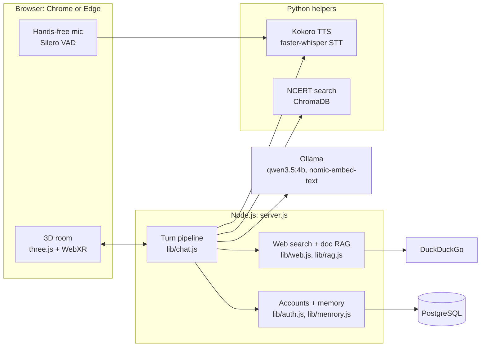
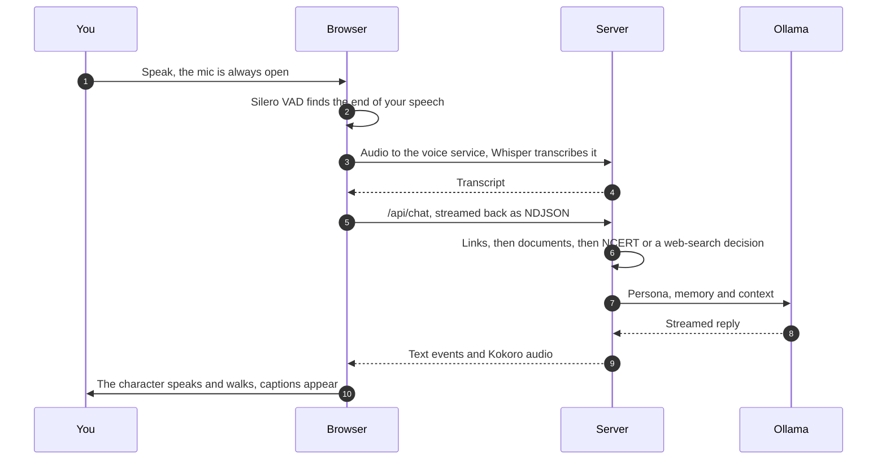

<div align="center">


### Hands-free video calls with AI companions that live in their own 3D rooms

[](LICENSE)
[](https://github.com/yashgadbail/hello-crew/actions/workflows/ci.yml)
[](https://nodejs.org)
[](https://www.python.org)
[](compose.yaml)
[](https://ollama.com)
[](#contributing)

**The open source answer to closed AI companions.**

Grok's companions from [xAI](https://x.ai) and ChatGPT's voice mode from [OpenAI](https://openai.com) are the
closest commercial equivalents: a character with a voice and a personality that you simply talk to. Hello Crew
is that idea, rebuilt in the open. The chat model, the voices and the speech recognition all run on your own
machine, the eight characters are defined in one file you can edit, and every line of it is MIT licensed.

</div>

---

## Contents

- [Why Hello Crew](#why-hello-crew)
- [Meet the crew](#meet-the-crew)
- [What every call includes](#what-every-call-includes)
- [Quick start (Docker)](#quick-start-docker-recommended)
- [Desktop app](#desktop-app)
- [Setup without Docker](#setup-without-docker-development)
- [NCERT textbooks (for Kiki)](#ncert-textbooks-for-kiki)
- [Using it on your phone](#using-it-on-your-phone)
- [Configuration](#configuration)
- [Architecture](#architecture)
- [Voices](#voices)
- [Notes and known limits](#notes-and-known-limits)
- [Contributing](#contributing)
- [License](#license)
- [Credits](#credits)

## Why Hello Crew

|  | Hello Crew | Closed companion apps |
|---|---|---|
| **Source code** | MIT. Fork it, change it, ship it | Proprietary |
| **Where the model runs** | Your machine, through [Ollama](https://ollama.com) | The vendor's cloud |
| **Speech recognition** | On device, faster-whisper | The vendor's cloud |
| **Voices** | On device, 54 Kokoro voices | The vendor's cloud |
| **Your conversations** | Your own PostgreSQL | The vendor's servers |
| **Cost** | Free. No API keys, no quota | An account, usually paid |
| **Characters** | Eight, each editable in `lib/personas.js` | Fixed by the vendor |
| **A 3D room each** | Yes, furnished with [Kenney](https://kenney.nl) props (CC0) | Varies |
| **Phone AR** | WebXR on Android Chrome | No |
| **Works offline** | Yes, except web search | No |

## Meet the crew

Pick someone from the contact list and call them. Each character lives in their own 3D room with its own voice, personality and speciality. You talk to them hands-free, like a video call, and they potter about their space: Bruno heads to the stove while he thinks, and Hugo goes to his laptop to check a claim.

| | Role | Room | Special ability |
|---|---|---|---|
| **Bruno** | Chef | Kitchen | Recipes, meal plans, substitutions |
| **Jasper** | Tech Helper | Desk | Coding, gadgets, troubleshooting |
| **Hugo** | Fact Checker | Detective's office | Searches the web for almost every claim and names his sources |
| **Leo** | Money & Career Coach | Lounge | Budgets, interviews, decisions |
| **Rosie** | Wellness Coach | Park | Workouts, sleep, stress relief |
| **Luna** | Science Explainer | Moon base | Space, science, how things work |
| **Kiki** | NCERT Tutor | Library | Confirms your class and subject, then teaches only from that NCERT textbook |
| **Bella** | Travel Planner | Campsite | Trips, itineraries, hidden gems |

## What every call includes

- **Hands-free voice, on-device.** The mic stays open like a meeting. Silero voice-activity detection runs in the browser, and Whisper transcribes on your machine, so no cloud speech service is needed (the browser's Web Speech API is only a fallback). The mic pauses while the character talks; tap the screen to interrupt.
- **Live captions, a call timer, and an optional self-view camera.**
- **Web search.** A small "router" step decides when a question needs current information (weather, news, prices…). The character then searches DuckDuckGo, reads the top pages, and cites them.
- **Your documents (RAG).** Upload a PDF or text file, or paste a link, from the chat drawer. The server embeds it with `nomic-embed-text`, and every character can answer from it.
- **Accounts and memory.** Sign up with your name, email and password, and the crew remembers *you* on any device. Each character keeps your chat history with them. The whole crew shares a small profile: how you like to talk (e.g. Hinglish, short answers), key facts you've mentioned (city, diet, job, goals…), and Kiki's study progress, so she can pick up where you left off. A background step updates the profile after each reply. **🧠 Memory** on the home page shows everything they remember; you can forget any item or erase it all. Everything is stored in your own PostgreSQL database. Passwords are scrypt-hashed, and logins use an HttpOnly session cookie.
- **Admin panel** (operators only, at http://localhost:3001). It shows all users, sign-ups, activity by character, and each user's memory profile, and lets you suspend a user, sign them out everywhere, or delete them. Every action is audit-logged. Conversation text is never shown.
- **AR.** On Android Chrome with ARCore, the **AR** button brings the character into your real room.

Everything runs locally: [Ollama](https://ollama.com) for the chat model and embeddings, [Kokoro-82M](https://github.com/thewh1teagle/kokoro-onnx) for the voices (with [KittenTTS](https://github.com/KittenML/KittenTTS) as a fallback), [faster-whisper](https://github.com/SYSTRAN/faster-whisper) for speech recognition, and [ChromaDB](https://www.trychroma.com) for the textbooks. Characters and rooms are [Kenney](https://kenney.nl) assets (CC0).

## Quick start (Docker, recommended)

The whole stack runs in Docker Compose and stays up: the app, the admin panel, PostgreSQL, Ollama (GPU), the voice service, textbook search, and nightly database backups.

```powershell
copy .env.example .env                                              # then fill in the blanks
powershell -ExecutionPolicy Bypass -File deploy\scripts\seed-volumes.ps1   # optional: reuse downloaded models/books
docker compose up -d --build
```

Then open the app at http://localhost:3000 and the admin panel at http://localhost:3001. **[docs/DEPLOYMENT.md](docs/DEPLOYMENT.md)** covers everything else: services, volumes, secrets, backups and restore, CI/CD, and moving to production.

## Desktop app

The desktop app runs the same agents on your own machine, with no server, no
database to install and no account. It is an Electron shell around the runtime in
`lib/`, storing conversations in SQLite and agents as JSON files.

```sh
npm install
npm run desktop
```

It opens a window, puts an icon in the tray, and keeps answering once the window
is closed. Quit from the tray to stop it. Everything lives in your user data
folder: `%APPDATA%/hello-crew-desktop` on Windows.

**Make your own agents.** Open "Agents and settings" from the tray. Give an agent
a name, a prompt and a model, and it appears on the home page straight away. An
agent you create gets a procedurally generated avatar, a coloured shape with eyes,
so it needs no 3D assets. Built-in characters keep their Kenney models, and saving
over one makes a local copy that overrides it.

**Per-agent models.** Each agent names its own model, so a quick helper can run a
small model while a tutor runs a larger one. Ollama is built in; the provider
interface in `lib/providers/` is where Claude or OpenAI would slot in.

> Running `npm run desktop` from inside another Electron app's terminal (Claude
> Code, VS Code's integrated terminal) can fail with `app is undefined`. Those
> apps set `ELECTRON_RUN_AS_NODE=1`, which makes Electron start as plain Node.
> Unset it first, or launch from a normal terminal.

## Setup without Docker (development)

1. Install [Node.js 22.13+](https://nodejs.org), [Ollama](https://ollama.com/download), and **Python 3.12 or older** (KittenTTS doesn't support 3.13 yet). You also need PostgreSQL. The easiest way is `docker compose up -d postgres`, with `DATABASE_URL` in `.env` pointing at it.
2. Pull the models:
   ```sh
   ollama pull qwen3.5:4b
   ollama pull nomic-embed-text
   ```
3. Set up the Python helpers (voices, on-device speech recognition, NCERT textbook search):
   ```sh
   py -3.12 -m venv .venv                                    # macOS/Linux: python3.12 -m venv .venv
   .venv\Scripts\python -m pip install -r requirements.txt   # macOS/Linux: .venv/bin/python -m pip ...
   ```
4. Start everything. This one command also launches the voice and textbook services. On first run it downloads the Kokoro voice model (about 200 MB) and the Whisper model:
   ```sh
   npm start
   ```
5. Open http://localhost:3000 in **Chrome or Edge** and call someone. Allow microphone access.

Without the Python helpers the app still works: it uses the browser's built-in voices, and Kiki explains from general knowledge.

## NCERT textbooks (for Kiki)

Kiki answers only from textbooks you've indexed into the local ChromaDB (`data/chroma`). Index them with:

```sh
# Download and index straight from ncert.nic.in (see `books` for known codes)
.venv\Scripts\python -m ncert.ingest download jesc1 jemh1        # Class 10 Science + Maths
.venv\Scripts\python -m ncert.ingest books                       # list known book codes

# Or index PDFs you've downloaded yourself (one PDF per chapter, e.g. jesc101.pdf…)
.venv\Scripts\python -m ncert.ingest folder "C:\Downloads\jesc1dd" --class 10 --subject science

.venv\Scripts\python -m ncert.ingest list                        # what's indexed
```

NCERT names chapter PDFs `<book code><chapter>.pdf` (e.g. `jesc101.pdf` is Class 10 Science, chapter 1). If `download` can't reach ncert.nic.in, get the book's zip from https://ncert.nic.in/textbook.php in your browser, unzip it, and use `folder`. The prelims, answers and appendix files are skipped automatically. Restart `npm start` after indexing, or wait a minute for the catalogue to refresh.

Each textbook is stored in its own ChromaDB collection (e.g. `ncert_c10_science`). All ten English-medium Class 10 books are supported: `jesc1 jemh1 jess1 jess2 jess3 jess4 jeff1 jefp1 jewe2 jehp1`. Hindi and Sanskrit books are left out because their PDFs use legacy fonts or scanned pages.

**How Kiki works:**

1. On every turn, a structured extraction step works out your **class**, **subject**, **chapter** and **topic** from the conversation. The class must come from you, never a guess.
2. If anything is missing, she asks for it. Before teaching, she repeats the book back ("Class 10 Science, is that right?") and waits for your yes. If you correct her, she confirms the new choice instead.
3. After you confirm, she opens only that book's collection. She searches the chapter you named, or finds the single best-matching chapter and stays inside it, then answers from those excerpts and cites the chapter and page. If the book doesn't cover your question, she says so.
4. In a call with Kiki, the **Books** button (or the 📖 chip) opens a bookshelf. Tap a book or chapter to pick it without speaking.

## Using it on your phone

The mic, camera and AR need **HTTPS** (or `localhost`). Pick one:

- **Tunnel (easiest):** run `cloudflared tunnel --url http://localhost:3000`, then open the `https://….trycloudflare.com` link it prints.
- **USB (Android):** run `adb reverse tcp:3000 tcp:3000`, then open `http://localhost:3000` in Chrome on the phone.
- **Your own certificate:** `SSL_KEY=key.pem SSL_CERT=cert.pem npm start`.

**Control who can sign up before you share a link.** Otherwise anyone who finds the URL can create an account and use your machine. In the admin panel's **Invites** tab:

- choose **Invite only**, **Open** or **Closed** (existing users can always sign in)
- create codes with a label, a max number of people and an expiry, then copy them to share
- disable or delete codes, and see who joined with each one

Changes apply immediately, with no restart. Any `INVITE_CODE` in `.env` is imported on startup, so a fresh install is invite-only from the first run. Links shared into the app can't reach private or local network addresses.

## Configuration

| Env var | Default | Purpose |
|---|---|---|
| `OLLAMA_MODEL` | `qwen3.5:4b` | Chat model. `llama3.2` replies faster (~0.3 s vs ~0.7 s) but is less capable. "Thinking" is switched off automatically |
| `STT_MODEL` / `STT_DEVICE` | `base.en` / `cpu` | Whisper model for on-device speech recognition (`small.en` is more accurate but slower) |
| `EMBED_MODEL` | `nomic-embed-text` | Embeddings for documents, web pages and textbooks |
| `OLLAMA_URL` | `http://127.0.0.1:11434` | Where Ollama runs |
| `PORT` | `3000` | Web server port |
| `TTS_ENGINE` | `kokoro` | `kitten` for the tiny KittenTTS voices instead |
| `KOKORO_MODEL` | `kokoro-v1.0.fp16.onnx` | Kokoro model file (downloaded to `data/kokoro/`) |
| `KITTEN_MODEL` | `KittenML/kitten-tts-nano-0.8` | KittenTTS model when `TTS_ENGINE=kitten` |
| `TTS_URL` / `NCERT_URL` | `:5005` / `:5006` | Where the Python helpers listen |
| `TTS_AUTOSTART` / `NCERT_AUTOSTART` | on | Set to `0` to run a helper yourself |
| `NCERT_DB` | `data/chroma` | ChromaDB folder for the textbooks |
| `DATABASE_URL` | `postgres://hellocrew:…@127.0.0.1:5433/hellocrew` | PostgreSQL for accounts and memory (set automatically in Docker) |
| `ADMIN_USERNAME` / `ADMIN_PASSWORD` | `admin` / none | Admin panel login. The password must be 12+ characters |
| `INVITE_CODE` | none | Invite code(s) imported on startup, comma-separated. Manage codes and the sign-up mode in the admin panel |
| `DEBUG_CHAT` | off | Log Kiki's extracted study context |
| `SSL_KEY` / `SSL_CERT` | none | Serve HTTPS directly |

## Architecture



**One turn of a call, end to end:**



**The file map:**

```
server.js            Static files, accounts (/api/auth), /api/chat (NDJSON events), /api/call, /api/memory, /api/docs, /api/tts; starts the Python helpers
lib/db.js            PostgreSQL pool + versioned migrations: users, sessions, messages, memory, admin audit
lib/auth.js          Sign up / sign in (scrypt), session cookies, login rate limiting
lib/memory.js        Per-user chat history, the shared profile (language, style, facts, study), learning from each turn, greetings
admin/               Admin panel (separate service, same image): users, stats, account controls, audit log
docker/              Dockerfiles: node (app + admin), python (voice / ncert targets)
compose.yaml         The stack; deploy/compose.prod.yaml adds production overrides
deploy/              Backup loop, volume seeding, Tailscale Funnel config
.github/workflows/   CI (checks + image builds) and release (push images to GHCR)
lib/personas.js      The eight characters: voice, model, room, prompt
lib/chat.js          One turn: links, then documents, then the NCERT textbook or a web-search decision, then a streamed reply
lib/web.js           DuckDuckGo search, safe page fetching (private-network guard), HTML to text
lib/rag.js           Chunking + Ollama embeddings + in-memory vector search for shared documents
tts_server.py        Voice service: KittenTTS (text to WAV) + faster-whisper (speech to text)
ncert/               ChromaDB textbook store, ingestion CLI, and search service
public/app.js        Landing page, call lifecycle, hands-free conversation, captions, chat drawer
public/stage.js      3D room, character direction (home, work and idle spots), video-call camera, AR
public/scenes.js     The eight rooms, laid out with Kenney props
public/avatar.js     Character loading and animation (walk, interact, head motion, talking bob)
public/voice.js      Speech out (KittenTTS/browser); hands-free speech in (local VAD+Whisper, or Web Speech)
public/docs.js       PDF to text in the browser (pdf.js), document API calls
```

## Voices

Each character has their own Kokoro voice: Bruno `am_fenrir`, Jasper `am_puck`, Hugo `bm_george`, Leo `am_michael`, Rosie `af_bella`, Luna `af_aoede`, Kiki `af_heart`, and Bella `bf_emma`. To change one, edit `KOKORO_VOICES` in `tts_server.py`. Kokoro has 54 voices, including Hindi (`hf_alpha`, `hm_omega`…), British, and more.

## Notes and known limits

- With the Python voice service running, speech recognition happens on your machine. Without it, the app falls back to the browser's Web Speech API, which in Chrome and Edge sends audio to the vendor's cloud service. It doesn't work at all in Brave, Opera or some embedded browsers.
- Windows: `tts_server.py` skips KittenTTS's unused `misaki`/spaCy import. That library's DLLs are blocked by Smart App Control. Kokoro runs on ONNX Runtime, which isn't blocked.

## Contributing

Issues and pull requests are welcome. Before opening a pull request:

```sh
npm run check        # syntax-checks every JavaScript file, the same check CI runs
```

Adding a character is the easiest place to start. Give it an entry in `lib/personas.js` (name, role, voice, colour, prompt) and a room in `public/scenes.js`.

## License

[MIT](LICENSE). Use it, change it, ship it, sell it. Just keep the license file with it.
Third-party components keep their own licenses; see [THIRD_PARTY_NOTICES.md](THIRD_PARTY_NOTICES.md).

## Credits

Built by **Prajakta Kharat**. Have fun!

Characters and rooms are [Kenney](https://kenney.nl) assets (CC0). The models and libraries that make the crew
talk and listen are credited in [THIRD_PARTY_NOTICES.md](THIRD_PARTY_NOTICES.md).
